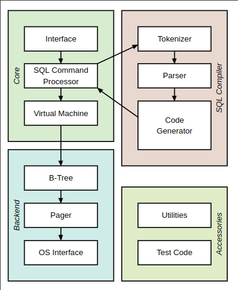

# QDB

Attempt to remake a simple SQL like database in C

## Syntax

- keywords can be capitalized or not
- one statement at a time no need for semicolon ;

```sql
select a, b, c from `tablename` where a = 1
```

```sql
select * from `tablename`
```

```sql
insert into `tablename` a = 1, b = 2, c = 3
```

```sql
update `tablename` set a = 1, c = 3
```

```sql
delete from `tablename` where a = 1
```

```sql
create `tablename` id int pk, b str[32], c float
```

```sql
drop `tablename`
```

## Steps

### Core

1. interface
2. SQL Command processor
   1. Lexer
   2. Parser
   3. Code generator
3. VM

### Backend

4. B-Tree
5. Pager
6. OS Interface

### Accessories

- Utilities
- Tests

## Sqlite architecture



## Sources

- [sqlite tutorial](https://www.sqlitetutorial.net/)
- [sqlite official documentation](https://www.sqlite.org/)
- [cstack db tutorial](https://cstack.github.io/db_tutorial/parts/part1.html)

## Lexer

1. keyword (select, insert into, update, create, drop)

1. select a, b, c from tablename where condition
1. update tablename set a=x where condition
1. insert (a, b, c, d) into tablename
1. create table tablename (
   attrname type PK,
   attrname type,
   ...
   )
